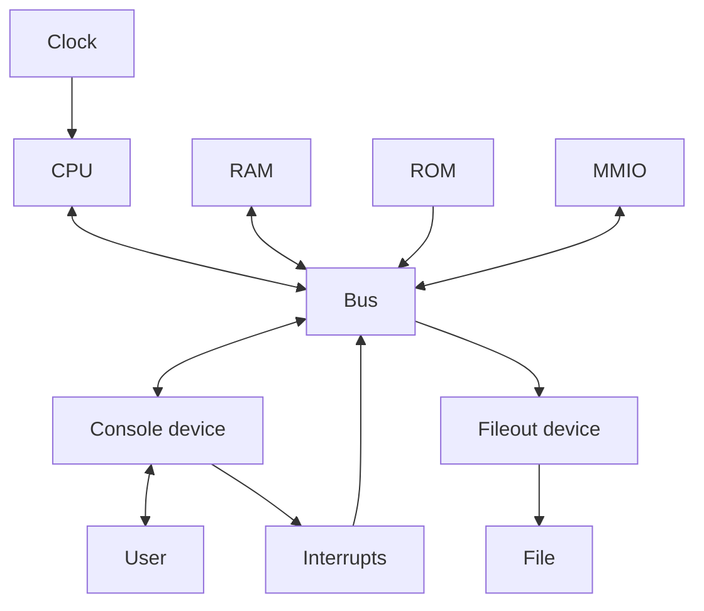

# Instruction Set Architecture (ISA) Documentation

This document outlines the Instruction Set Architecture (ISA) defined in the `ISA_H` and `BUS_H` header files, detailing the opcode specifications, addressing modes, and the structure of instructions within this custom architecture. Additionally, it includes a brief overview of the system bus interface and the memory model.

## Emulator Architecture

## Overview

This ISA defines a set of operations that can be performed by a processor, including arithmetic operations, data movement, control flow instructions, and system instructions. Instructions are encoded with varying widths for opcodes, addressing modes, and operands to accommodate different types of operations.

## Instruction Encoding

- **OPCODE_WIDTH**: The width of the opcode field, set to 1 byte.
- **AM_WIDTH**: The width of the addressing mode field, also set to 1 byte.
- **OPERAND_WIDTH**: The width of the operand field, set to 8 bytes to accommodate 64-bit operands.
- **INSTRUCTION_WIDTH**: The total width of an instruction, calculated as the sum of the widths of the opcode, two addressing modes, and two operands.

| Opcode (8 bits) | Addressing Mode 1 (8 bits) | Addressing Mode 2 (8 bits) | Operand 1 (64 bits) | Operand 2 (64 bits)   |
|-----------------|----------------------------|----------------------------|----------------------|----------------------|
| 1 byte          | 1 byte                     | 1 byte                     | 8 bytes              | 8 bytes              |
| 0x01            | 0x01                       | 0x01                       | 0x0000000000000000   | 0x0000000000000000   |

## Opcodes

Opcodes define the operation to be performed by the instruction. The following opcodes are defined:

- **OP_NOP**: No operation.
- **OP_MOV**: Move data from the source operand to the destination operand.
- **OP_PUSH**: Push the source operand onto the stack.
- **OP_POP**: Pop the top of the stack into the destination operand.
- **OP_ADD**: Add the source operand to the destination operand.
- **OP_SUB**: Subtract the source operand from the destination operand.
- **OP_MUL**: Multiply the source operand with the destination operand.
- **OP_DIV**: Divide the destination operand by the source operand.
- **OP_JMP**: Jump to the address specified by the destination operand.
- **OP_CMP**: Compare the source and destination operands.
- **OP_JEQ**: Jump if equal, based on the previous comparison result.
- **OP_CALL**: Call a subroutine at the address specified by the destination operand.
- **OP_RET**: Return from a subroutine.
- **OP_RST**: Reset the processor.
- **OP_HLT**: Halt the processor.

## Addressing Modes

Addressing modes define how the operands of an instruction are to be interpreted:

- **AM_NONE**: No addressing mode.
- **AM_IMMEDIATE**: The operand is an immediate value.
- **AM_REGISTER**: The operand is a register.

## Instruction Structure

The `Instruction` structure represents an instruction and contains the following fields:

- **opcode**: The operation code.
- **srcMode**: The addressing mode for the source operand.
- **destMode**: The addressing mode for the destination operand.
- **srcOperand**: The source operand.
- **destOperand**: The destination operand.

## System Bus Interface

The system bus interface includes definitions for memory regions and functions for reading and writing memory:

- **Memory Regions**: Defines the start and end addresses for RAM, ROM, and MMIO (Memory-Mapped I/O).
- **BUS_Read**: Function to read data from a memory address.
- **BUS_Write**: Function to write data to a memory address.

## Processor State and Control

The global section defines processor registers, instruction handling functions, and status flags. This includes general-purpose registers, instruction and program counters, stack pointer, return address register, and flags for overflow, carry, sign, and zero conditions.

## Instruction Set

The `instructionSet` array predefines configurations for each instruction type, including opcodes, addressing modes, and operand requirements.

## Functions

A list of function signatures for instruction handlers and control functions like `CPU_Reset` and `CPU_ValidateInstruction`.

## Conclusion

This document provides a comprehensive overview of the custom ISA, including instruction formats, opcode specifications, addressing modes, and the structure of instructions. It serves as a reference for understanding how instructions are defined, encoded, and executed within this architecture.